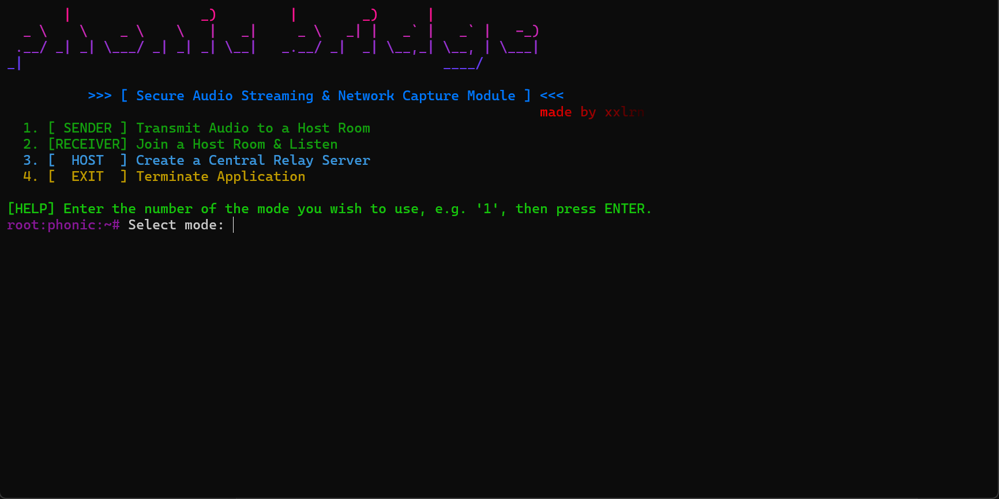
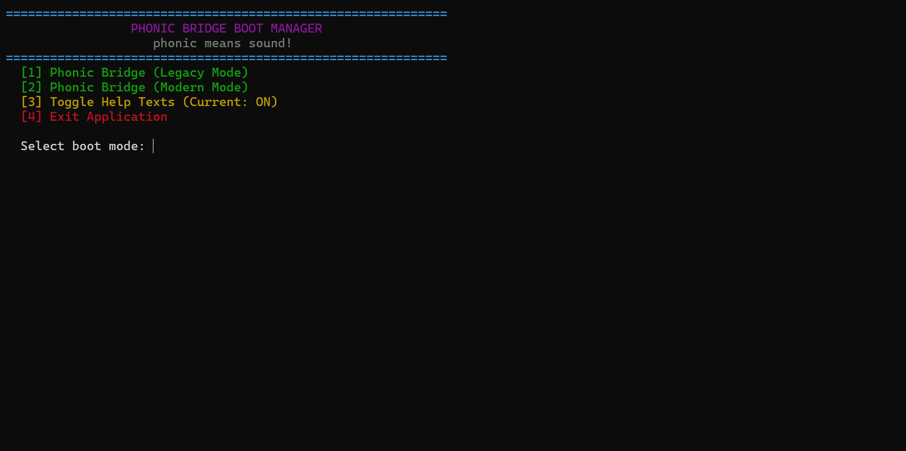
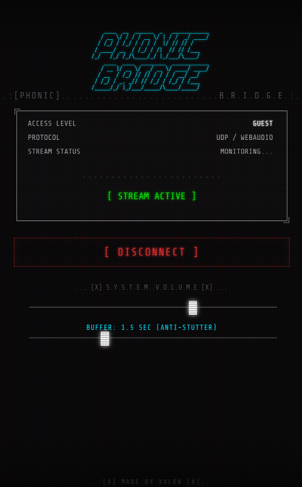
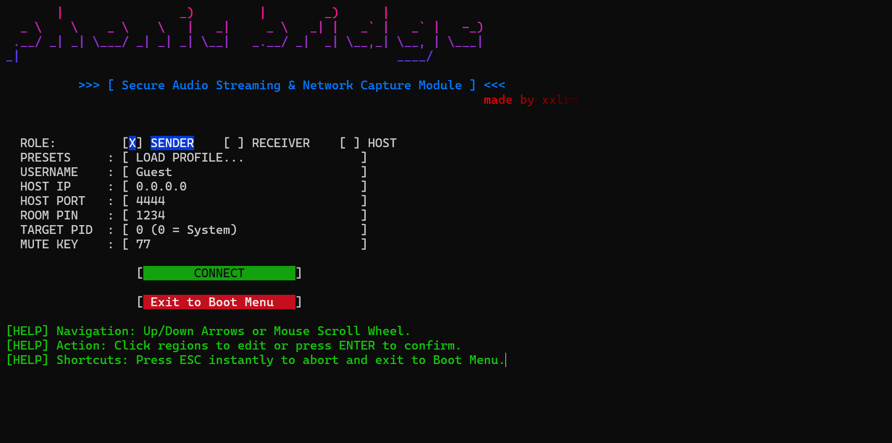
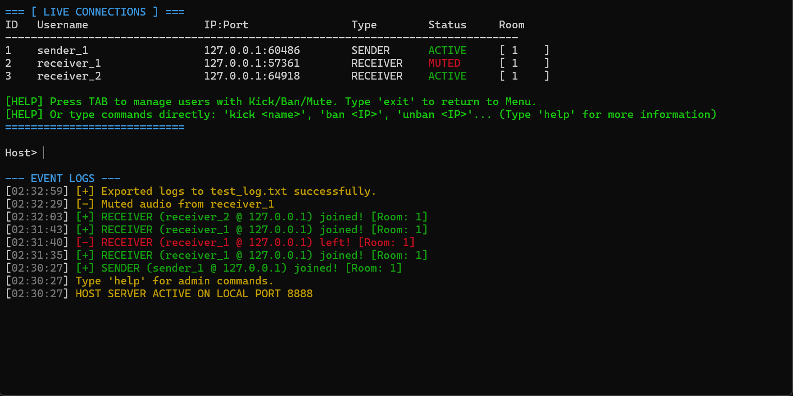

<p align="center">
  
</p>

<p align="center">
  <strong>Secure Audio Streaming & Network Capture Module</strong><br>
  <sub>Zero-latency, lossless audio bridge — capture any sound and stream it anywhere.</sub>
</p>

<p align="center">
  
  
  
  
  
</p>

---

## What is Phonic Bridge?

Phonic Bridge is a lightweight C++ application that captures audio from your computer and streams it in real-time to anyone on your network — or across the internet. No virtual audio cables, no browser extensions, no quality loss.

Built entirely with native Windows APIs (WASAPI for audio, Winsock2 for networking), it delivers **bit-perfect, studio-quality audio** with near-zero latency.

**Made by [XXLRN](https://github.com/mericeraykurt).**

<p align="center">
  
  <br><sub>Boot Manager — Choose Legacy or Modern interface</sub>
</p>

---

## ⚡ Quick Start (30 seconds)

> **You just need `app.exe`. No installation required.**

| Step | What to do |
|------|-----------|
| **1** | Download `app.exe` and run it. |
| **2** | One person presses **`3`** to become the **Host** (choose any port, e.g. `4444`). |
| **3** | The music person presses **`1`** to become the **Sender** (enter Host's IP + port). |
| **4** | Everyone else presses **`2`** to become a **Receiver** (same IP + port + Room PIN). |
| **5** | 🎵 **Done!** Audio is now streaming in real-time. |

> **Same PC?** Use `127.0.0.1` as the IP. **Same WiFi?** Use the Host's local IP (run `ipconfig` to find it). **Over the internet?** Use a VPN like Radmin — see the [Internet Setup Guide](#-playing-over-the-internet) below.

> ⚠️ **First launch:** Windows SmartScreen may show a warning because the app is not digitally signed. Click **"More info"** → **"Run anyway"**. This is normal for independent open-source software.

---

## ✨ Features

### Audio Engine
- **Lossless WASAPI Capture** — Captures audio at 32-bit Float, 48kHz stereo directly from the Windows sound engine. No quality loss, no resampling.
- **App-Specific Capture** — Target a specific application (Spotify, FL Studio, a game) by PID, or capture the entire system output.
- **Real-Time Playback** — Audio plays on receivers within milliseconds, with adjustable buffer for stability.

### Networking
- **UDP Relay Architecture** — One Host bridges Senders and Receivers. Fast, efficient, no peer-to-peer headaches.
- **Auto-Reconnect** — If the connection drops, receivers automatically reconnect and resume playback.
- **Thread-Safe Broadcast** — Audio packets are queued and delivered safely across threads, preventing data corruption.
- **UPnP Port Forwarding** — One-click automatic router port opening for internet hosting.

### Web Streaming
- **Built-in Web Server** — Receivers can share audio to phones/tablets on the same network via a browser.
- **Mobile-Optimized UI** — Retro terminal-themed web player with volume control, buffer adjustment, and live status.
- **Background Playback** — MediaSession API integration keeps audio playing when the browser tab is minimized or the phone screen is locked.
- **Access Control** — IP-based whitelist system with a visual LAN device manager.

<p align="center">
  
  <br><sub>Mobile Web Client — Stream audio to any phone or tablet</sub>
</p>

### Administration
- **Live Connection Dashboard** — Host sees all connected users in real-time with status, role, IP, and room info.
- **Kick / Ban / Mute** — Full admin controls with interactive TUI (Tab to select, arrow keys to navigate).
- **Event Logging** — Timestamped logs with color coding, exportable to clean text files via `glog`.

### User Experience
- **Dual Interface** — Choose between Legacy Mode (keyboard-only CLI) or Modern Mode (mouse + keyboard dashboard).
- **Profile System** — Save and load `.xxlrn` profiles for instant reconnection with saved IP, port, PIN, and settings.
- **Dynamic Mute Hotkeys** — Bind mute to any key including mouse buttons, numpad keys, or gamepad buttons.
- **Volume Control** — Local volume adjustment (0–200%) with a visual volume bar. Web clients remember their volume across sessions.

<p align="center">
  
  <br><sub>Modern Mode — Interactive dashboard with mouse support</sub>
</p>

---

## 🏗️ How It Works

Phonic Bridge uses a **3-Way Relay Architecture**:

```
┌──────────┐         ┌──────────┐         ┌──────────────┐
│  SENDER  │──UDP──▶│   HOST   │──UDP──▶ │  RECEIVER(s) │
│ Captures │         │  Relays  │         │  Plays Audio │
│  Audio   │         │  Traffic │         │              │
└──────────┘         └──────────┘         └──────┬───────┘
                                                 │ WebSocket
                                          ┌──────▼───────┐
                                          │ WEB CLIENTS  │
                                          │ (Phone/Tab)  │
                                          └──────────────┘
```

**Sender** captures audio using WASAPI and sends raw Float32 PCM packets over UDP to the **Host**. The Host relays those packets to all **Receivers** in the same room (matched by PIN). Receivers can optionally run a built-in Mongoose web server to stream audio to additional devices via WebSocket.

---

## 📌 Detailed Role Guide

### 🖥️ Host — The Bridge Server

The Host is the central relay. All traffic flows through it. **It does not play or capture audio itself.**

1. Open `app.exe` and select **Host** (option `3`).
2. Choose a port number (e.g., `4444`). This port must be reachable by all users.
3. Choose **Secure Mode** (VPN/LAN only) or **UPnP Mode** (auto-opens the port on your router).
4. The Host console shows a live dashboard of all connected users.

<p align="center">
  
  <br><sub>Host — Live connection tracker with event logs</sub>
</p>

**Admin Commands** (type in the Host console):

| Command | Description |
|---------|-------------|
| `kick <name>` | Disconnect a user |
| `ban <name>` | Permanently block a user by IP |
| `unban <ip>` | Remove an IP from the ban list |
| `mute <name>` | Stop routing a user's audio |
| `unmute <name>` | Restore audio routing |
| `glog [file]` | Export event logs to a text file |
| `clear` | Clear the event log |
| `help` | Show all commands |

> **Tip:** Press `TAB` in the Host console to open an interactive user selector with arrow keys.

---

### 🎤 Sender — The Audio Source

The Sender captures audio from your PC and transmits it to the Host.

1. Open `app.exe` and select **Sender** (option `1`).
2. Enter the **Host IP**, **Port**, and **Room PIN**.
3. Choose what to capture:
   - Enter `0` to capture **all system audio**.
   - Enter a **PID** to capture a specific application (like Spotify only).
   - Press `T` to click on a window to auto-detect its PID.
4. Set your mute hotkey (press any key to bind it).
5. Audio starts streaming immediately!

**Controls during streaming:**

| Key | Action |
|-----|--------|
| Mute Hotkey | Toggle audio transmission |
| `P` | Change target application (hot-swap PID) |
| `ESC` | Disconnect and return to menu |

---

### 🎧 Receiver — The Listener

The Receiver connects to the Host and plays incoming audio through your speakers.

1. Open `app.exe` and select **Receiver** (option `2`).
2. Enter the **same Host IP**, **Port**, and **Room PIN** as the Sender.
3. Optionally enable the **Web Stream** to share audio to phones on your network.
4. Audio plays automatically!

**Controls during playback:**

| Key | Action |
|-----|--------|
| Mute Hotkey | Toggle local mute |
| `→` Right Arrow | Volume up (+5%) |
| `←` Left Arrow | Volume down (-5%) |
| `W` | Open Web Client Manager (authorize mobile devices) |
| `ESC` | Disconnect and return to menu |

---

## 🌐 Playing Over the Internet

If you and your friends are on **different networks** (different houses, different WiFi), audio packets can't reach each other directly because routers block unsolicited incoming UDP traffic. You need a way to connect everyone to the same virtual network first.

### Option A: Radmin VPN (Recommended — Free & Simple)

**[Radmin VPN](https://www.radmin-vpn.com)** creates a virtual local network over the internet. Once connected, everyone appears as if they're on the same WiFi — no port forwarding, no router settings, no technical knowledge needed.

> *Disclaimer: I am not sponsored by or affiliated with Radmin VPN in any way. It's simply a free, reliable tool that I personally used to build and test this project.*

#### Step-by-Step Setup:

**Step 1 — Download & Install (Everyone)**

Every person who wants to participate (Host, Sender, and all Receivers) must install Radmin VPN:
1. Go to **https://www.radmin-vpn.com** and click the download button.
2. Install it with default settings. A short restart may be required.
3. Open Radmin VPN after installation.

**Step 2 — Create the Network (Host only)**

The person who will be the **Host** creates the private network:
1. In Radmin VPN, click **`Network`** in the top menu bar.
2. Click **`Create Network`**.
3. Enter a **Network Name** (e.g., `MusicRoom`) and a **Password** (e.g., `1234`).
4. Click **Create**. Your network is now live!
5. Share the Network Name and Password with your friends (via Discord, WhatsApp, etc.).

**Step 3 — Join the Network (Everyone else)**

Friends who want to connect:
1. In Radmin VPN, click **`Network`** → **`Join Network`**.
2. Enter the exact **Network Name** and **Password** the Host shared.
3. Click **Join**. You should now see the Host's PC name appear in the list.

**Step 4 — Find the Host's IP**

Once everyone is connected in Radmin VPN:
1. Look at the Radmin VPN window. You'll see a list of connected PCs.
2. Next to the **Host's PC name**, there's an IP address — it usually starts with **`26.x.x.x`** (e.g., `26.107.42.15`).
3. **This is the IP everyone enters into Phonic Bridge** when it asks for "Host IP".

**Step 5 — Connect in Phonic Bridge**

1. The Host opens `app.exe` and presses `3` (Host mode). Choose a port (e.g., `4444`). Choose **Secure Mode**.
2. The Sender opens `app.exe`, presses `1`, and enters the **Radmin IP** (e.g., `26.107.42.15`), the port (`4444`), and a Room PIN.
3. Receivers open `app.exe`, press `2`, and enter the **same Radmin IP**, port, and PIN.
4. 🎵 **You're streaming!**

#### Troubleshooting

| Problem | Solution |
|---------|----------|
| Can't see Host in Radmin | Make sure both PCs are on the same Radmin network (correct name + password). Try restarting Radmin VPN. |
| IP doesn't start with `26.x.x.x` | This is fine — some Radmin versions use different ranges. Use whatever IP is shown next to the Host's name. |
| "Connection timed out" in Phonic Bridge | Double-check the IP and port. Make sure the Host started first and is running. Try pinging the Host's Radmin IP from Command Prompt: `ping 26.x.x.x` |
| Audio plays but with heavy delay | Radmin VPN adds minimal latency (~5-20ms). If delay is severe, check your internet speed or try reducing the buffer slider on the Receiver. |
| Radmin shows a yellow/red icon | The connection between the two PCs is relayed (not direct). This still works but may have slightly higher latency. |

---

### Option B: UPnP Port Forwarding (No VPN needed)

If you don't want to install any VPN software, Phonic Bridge can try to automatically open a port on your router:

1. When starting the Host, choose **UPnP Mode** (option `2`).
2. Phonic Bridge will instruct your router to open the chosen port automatically.
3. If successful, friends can connect using your **public IP** (Google "what is my ip") and the port you chose.

> ⚠️ **Note:** UPnP must be enabled on your router. Some ISPs block this. Some routers don't support it. If UPnP fails, use Radmin VPN instead — it always works.

---

## 🔨 Building from Source

### Requirements
- **Windows 10/11** (x64)
- **Visual Studio 2022** with the "Desktop Development with C++" workload
- No external dependencies — Mongoose web server is included in the repo.

### Build Steps

```
1. Open "x64 Native Tools Command Prompt for VS 2022"
2. Navigate to the project folder
3. Run: build.bat
4. Output: app.exe
```

The build script compiles `main.cpp` and `mongoose.c` with `/O2` optimizations and links against standard Windows libraries.

---

## 📁 Project Structure

```
phonic-bridge/
├── main.cpp          # Full application source (~3400 lines)
├── index.html.h      # Embedded web client UI (HTML/CSS/JS as C++ string)
├── mongoose.c        # Mongoose embedded web server (v7)
├── mongoose.h        # Mongoose headers
├── build.bat         # MSVC build script
├── version.rc        # Windows version resource (app metadata)
├── .gitignore        # Git ignore rules
├── LICENSE           # All Rights Reserved
├── README.md         # This file
└── screenshots/      # Application screenshots for documentation
```

---

## 🤝 Contributing

This project is **source-available** but **not open-source**. You may study the code for learning purposes, but you may not copy, modify, or redistribute it without permission.

That said, feedback is very welcome! Feel free to:
- **Open an Issue** to report bugs or suggest features.
- **Start a Discussion** to ask questions or share ideas.

If you're interested in contributing code or proposing a partnership, please contact the author directly.

---

## 📖 Story

This project started because I produce music and often share demo tracks with friends over Discord. We used to listen through Discord bots or screen sharing, but that either caused heavy lag (making it impossible to game at the same time) or completely ruined the audio quality.

I promised a friend I would find a real solution to this problem we'd suffered through for years — and here it is. A simple, lightweight, yet incredibly effective audio tool. Happy listening! 🎵

---

## ⚖️ License

**Copyright © 2026 Meriç Eray Kurt (XXLRN). All Rights Reserved.**

This software is source-available for educational and reference purposes only. You may **not** copy, modify, distribute, or use this code without explicit written permission. See [LICENSE](LICENSE) for full terms.


For commercial use or partnership inquiries, contact the author directly.
